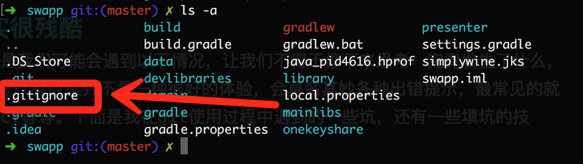

#安卓代码管理工具—使用Git管理代码
##前言+速成
我们项目有两人，项目中少不少协同开发，git是***分布式项目管理工具***，每个人在本地维护一个独立的管理仓库，开发过程中互不干扰，开发完成之后可以提交主仓库进行合并，其次，git在国内有几大免费的代码库可供使用（相比github只有开源代码才可免费使用），如下：
> 码云:[http://git.oschina.net/](http://git.oschina.net/)
> 
> Coding:[https://coding.net](https://coding.net)

另外git的使用方法也很简单，配置好用户名密码之后，下载代码pull一下，上传代码三部曲(add,commit和push，通过&&符号甚至可以合并成一行)。

1、将远程库的引用（git地址是上面两个仓库服务商会提供的，origin名字是可以自定义的，代表远程仓库的地址，定义好之后步骤2和3都需要使用）加到本地:

```
git remote add origin https://git.coding.net/***/***.git
```

2、同步服务器代码到本地:

```
git pull origin master
```

3、上传全部变动代码到git仓库中:

```
git add . 
git commit -a -m "说说你更新了什么代码"
git push origin master
```
> 甚至上传代码可以这样写成一行:
	```
	git add . && git commit -a -m "更新了xxxx" && git push 	origin master
	```

在没有冲突的情况下，以上三个步骤就可以完整解决代码分布式的问题了，但...

##现实很残酷
现实情况是我们可能会遇到以下情况，让我们不得不停下来思考：究竟发生了什么，原来使用git有时候并不是一种很好的体验，会莫名其妙各种出错提示，最常见的就是confict等等。下面是我在git使用过程中遇到的一些坑，还有一些填坑的技巧...
###发现冲突了，原来是有些文件根本没必要上传！
其实很简单，一般代码管理工具都有忽略文件列表，这些文件不需要传到仓库，如本地build apk的临时文件，还有idea ide的一些配置文件，这些文件不能全部上传到代码库中，需要忽略掉，在git中忽略一个文件很简单，在项目根目录加入一个.gitignore就行了，如下图：



如果没有上述文件，新建一个就行了，打开这个文件：

```

	# Built application files
	*.apk
	*.ap_
	
	# Files for the ART/Dalvik VM
	*.dex
	
	# Java class files
	*.class
	
	# Generated files
	bin/
	gen/
	out/
	
	# Gradle files
	.gradle/
	build/
	
	# Local configuration file (sdk path, etc)
	local.properties
	
	# Proguard folder generated by Eclipse
	proguard/
	
	# Log Files
	*.log
	
	# Android Studio Navigation editor temp files
	.navigation/
	
	# Android Studio captures folder
	captures/
	
	# Intellij
	*.iml
	.idea/*
	
```

这个里面就是忽略一些我们不需要上传的文件，这个文件从哪来的呢？git官网就有！[点击查看](https://github.com/github/gitignore),上面的示例我对官网的文件做了一些修改，忽略文件范围更全。
> 说说我遇到的坑：本以为加入一个gitignore理论上来讲就行了，不用担心不需要的文件继续上传的问题了，但是我当时死活都不行，忽略的文件依然可以上传，我发现，这个gitignore只对没有加入暂存区的文件有效，也就是说，如果你在git add .之后才加入gitignore，还需要git rm xxx，把这些文件手动忽略了，执行以下两个命令就行了

```
git rm --cache .
git add .
```
先把文件从暂存区中去除，然后再加进去，再加进去的时候git会自动应用gitignore的规则，这样就解决了安卓分布式开发的老大难问题，这样小伙伴就不用担心每次同步都是一大堆冲突了！

##浅谈Git的原理
###这部分等有空再加

##Git常用命令合集
这是我当初在学习GIT时候，网上看到的思维导图图，思维导图也是我推崇的一种思考的方式，这张图也不知道谁画的，总之感谢那个人！现在分享给大家：

